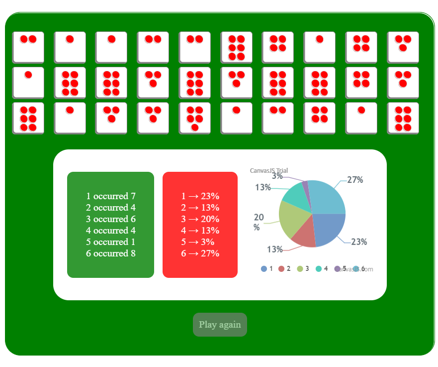

# Throws-a-dice-for-x-amount-of-times
Where x is a variable in your program, while "throwing" the dice your program should store how many times each value appeared, then print the number of occurrences for each number.

